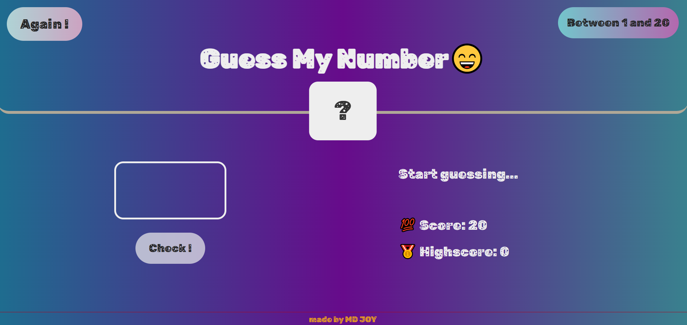

  


# Project Title

## This project is based on Jonas Schmedtmann's [Advanced JavaScript](https://www.udemy.com/user/jonasschmedtmann/) course. You should check his course. All the credits go to my beautiful teacher Jonas Schmedtmann--

## Guess-my-number---JAVASCRIPT

✅[View demo](https://ph0enix46.github.io/Guess-my-number---JAVASCRIPT/) 🐛[Bug report](https://github.com/pH0enix46/Guess-my-number---JAVASCRIPT/issues)


## About Guess-my-number
It's a Guess my number game based on some JAVASCRIPT ideas.

### Screenshots


## Installation

Clone the repo
```
https://github.com/pH0enix46/Guess-my-number---JAVASCRIPT.git
```

✅Enjoy! for learning 

❌But don't copy mine
## Acknowledgments
My lovely teacher [Jonas Schmedtmann](https://github.com/jonasschmedtmann)


```
Have a nice Day!😸
```
